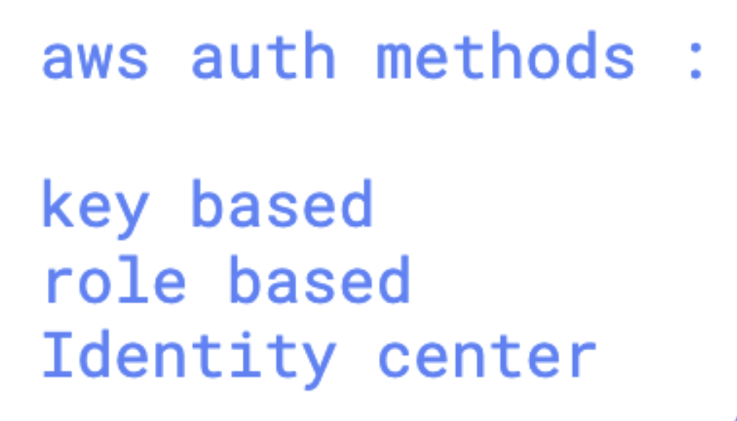

# roche_devops_4thnov2025

## Connecting to remote ssh machine 

```bash
humanfirmware@darwin  ~  ssh   ashu@15.134.107.225  
ashu@15.134.107.225's password: 
    ,     #_
    ~\_  ####_        Amazon Linux 2023
  ~~  \_#####\
  ~~     \###|
  ~~       \#/ ___   https://aws.amazon.com/linux/amazon-linux-2023
    ~~       V~' '->
     ~~~         /
        ~~._.   _/
            _/ _/
         _/m/'
Last failed login: Tue Nov  4 05:17:51 UTC 2025 from 196.3.49.254 on ssh:notty
There was 1 failed login attempt since the last successful login.
[ashu@ip-172-31-5-155 ~]$ 
```

## Git clone process 

```bash
[ashu@ip-172-31-5-155 ~]$ git   --version
git version 2.50.1
[ashu@ip-172-31-5-155 ~]$ git   -v
git version 2.50.1
[ashu@ip-172-31-5-155 ~]$ git clone https://github.com/redashu/ashu-roche-devops-code.git
Cloning into 'ashu-roche-devops-code'...
remote: Enumerating objects: 3, done.
remote: Counting objects: 100% (3/3), done.
remote: Total 3 (delta 0), reused 0 (delta 0), pack-reused 0 (from 0)
Receiving objects: 100% (3/3), done.
[ashu@ip-172-31-5-155 ~]$ ls
ashu-roche-devops-code
[ashu@ip-172-31-5-155 ~]$ cd ashu-roche-devops-code/
[ashu@ip-172-31-5-155 ashu-roche-devops-code]$ echo helloo >a.txt
[ashu@ip-172-31-5-155 ashu-roche-devops-code]$ ls
README.md  a.txt
[ashu@ip-172-31-5-155 ashu-roche-devops-code]$ 
```

## Git workflow process

```bash
[ashu@ip-172-31-5-155 ashu-roche-devops-code]$ ls
README.md  a.txt
[ashu@ip-172-31-5-155 ashu-roche-devops-code]$ git  status
On branch master
Your branch is up to date with 'origin/master'.

Untracked files:
  (use "git add <file>..." to include in what will be committed)
    a.txt

nothing added to commit but untracked files present (use "git add" to track)
[ashu@ip-172-31-5-155 ashu-roche-devops-code]$ git add   . 
[ashu@ip-172-31-5-155 ashu-roche-devops-code]$ git  status
On branch master
Your branch is up to date with 'origin/master'.

Changes to be committed:
  (use "git restore --staged <file>..." to unstage)
    new file:   a.txt

[ashu@ip-172-31-5-155 ashu-roche-devops-code]$ git  commit  -m  "just  adding"
Author identity unknown

*** Please tell me who you are.

Run

  git config --global user.email "you@example.com"
  git config --global user.name "Your Name"

to set your account's default identity.
Omit --global to set the identity only in this repository.

fatal: empty ident name (for <ashu@ip-172-31-5-155.ap-southeast-2.compute.internal>) not allowed
[ashu@ip-172-31-5-155 ashu-roche-devops-code]$  git config --global user.email  ashutoshh@linux.com 
[ashu@ip-172-31-5-155 ashu-roche-devops-code]$  git config --global user.name  redashu
[ashu@ip-172-31-5-155 ashu-roche-devops-code]$ git  commit  -m  "just  adding"
[master fe9e771] just  adding
 1 file changed, 1 insertion(+)
 create mode 100644 a.txt
[ashu@ip-172-31-5-155 ashu-roche-devops-code]$ git status
On branch master
Your branch is ahead of 'origin/master' by 1 commit.
  (use "git push" to publish your local commits)

nothing to commit, working tree clean
```


### creating ssh-key pair 

```
ssh-keygen  -t  rsa 
Generating public/private rsa key pair.
Enter file in which to save the key (/home/ashu/.ssh/id_rsa): 
Created directory '/home/ashu/.ssh'.
Enter passphrase (empty for no passphrase): 
Enter same passphrase again: 
Your identification has been saved in /home/ashu/.ssh/id_rsa
Your public key has been saved in /home/ashu/.ssh/id_rsa.pub
The key fingerprint is:
SHA256:ba0WC6PansnujYvu+iMmsp6F7NqpN9zwcghQTNCPp/o ashu@ip-172-31-5-155.ap-southeast-2.compute.internal
The key's randomart image is:
+---[RSA 3072]----+
|.=.              |
|  +              |
| . o             |
|. . o    . .     |

```
### doing more 

```
[ashu@ip-172-31-5-155 ashu-roche-devops-code]$ cd ..
[ashu@ip-172-31-5-155 ~]$ ls
ashu-roche-devops-code
[ashu@ip-172-31-5-155 ~]$ rm -rf ashu-roche-devops-code/
[ashu@ip-172-31-5-155 ~]$ ls
[ashu@ip-172-31-5-155 ~]$ 
[ashu@ip-172-31-5-155 ~]$ 
[ashu@ip-172-31-5-155 ~]$ git clone   git@github.com:redashu/ashu-roche-devops-code.git 
Cloning into 'ashu-roche-devops-code'...
The authenticity of host 'github.com (4.237.22.38)' can't be established.
ED25519 key fingerprint is SHA256:+DiY3wvvV6TuJJhbpZisF/zLDA0zPMSvHdkr4UvCOqU.
This key is not known by any other names
Are you sure you want to continue connecting (yes/no/[fingerprint])? yes
Warning: Permanently added 'github.com' (ED25519) to the list of known hosts.
remote: Enumerating objects: 9, done.
remote: Counting objects: 100% (9/9), done.
remote: Compressing objects: 100% (5/5), done.
remote: Total 9 (delta 1), reused 5 (delta 0), pack-reused 0 (from 0)
Receiving objects: 100% (9/9), done.
Resolving deltas: 100% (1/1), done.
[ashu@ip-172-31-5-155 ~]$ ls
ashu-roche-devops-code

```

## git pull 

```
ashu@ip-172-31-5-155 ashu-roche-devops-code]$ ls
README.md  a.txt  b.txtx  c.txt
[ashu@ip-172-31-5-155 ashu-roche-devops-code]$ 
[ashu@ip-172-31-5-155 ashu-roche-devops-code]$ cat c.txt 
okey
[ashu@ip-172-31-5-155 ashu-roche-devops-code]$ git pull
remote: Enumerating objects: 5, done.
remote: Counting objects: 100% (5/5), done.
remote: Compressing objects: 100% (2/2), done.
remote: Total 3 (delta 1), reused 0 (delta 0), pack-reused 0 (from 0)
Unpacking objects: 100% (3/3), 914 bytes | 914.00 KiB/s, done.
From github.com:redashu/ashu-roche-devops-code
   f5b792b..e58547d  master     -> origin/master
Updating f5b792b..e58547d
Fast-forward
 c.txt | 1 +
 1 file changed, 1 insertion(+)
[ashu@ip-172-31-5-155 ashu-roche-devops-code]$ cat c.txt 
okey
hii this is ashutoshh
[ashu@ip-172-31-5-155 ashu-roche-devops-code]$ 


```

## info about terraform 


### installing amazon linux 

```
 1  sudo yum install -y yum-utils shadow-utils
    2  sudo yum-config-manager --add-repo https://rpm.releases.hashicorp.com/AmazonLinux/hashicorp.repo
    3  sudo yum install terraform

```

### aws auth methods 




### terraform init 

```
terraform  init  
Initializing the backend...
Initializing provider plugins...
- Finding hashicorp/aws versions matching "6.19.0"...
- Installing hashicorp/aws v6.19.0...


- Installed hashicorp/aws v6.19.0 (signed by HashiCorp)
Terraform has created a lock file .terraform.lock.hcl to record the provider
selections it made above. Include this file in your version control repository
so that Terraform can guarantee to make the same selections by default when
you run "terraform init" in the future.

Terraform has been successfully initialized!

You may now begin working with Terraform. Try running "terraform plan" to see
any changes that are required for your infrastructure. All Terraform commands
should now work.

If you ever set or change modules or backend configuration for Terraform,
rerun this command to reinitialize your working directory. If you forget, other
commands will detect it and remind you to do so if necessary.

```

### terraform plan 

```

```

### terraform apply 

```
terraform apply 

Terraform used the selected providers to generate the following execution plan. Resource actions are indicated with
the following symbols:
  + create

Terraform will perform the following actions:

  # aws_instance.example will be created
  + resource "aws_instance" "example" {
      + ami                                  = "ami-0a25a306450a2cba3"
      + arn                                  = (known after apply)
      + associate_public_ip_address          = (known after apply)
      + availability_zone                    = (known after apply)
```

### terraform destroy 

```
 terraform  destroy 
aws_instance.example: Refreshing state... [id=i-02dd2e9a69b636219]

Terraform used the selected providers to generate the following execution plan. Resource actions are indicated with the following symbols:
  - destroy

Terraform will perform the following actions:

  # aws_instance.example will be destroyed
```
