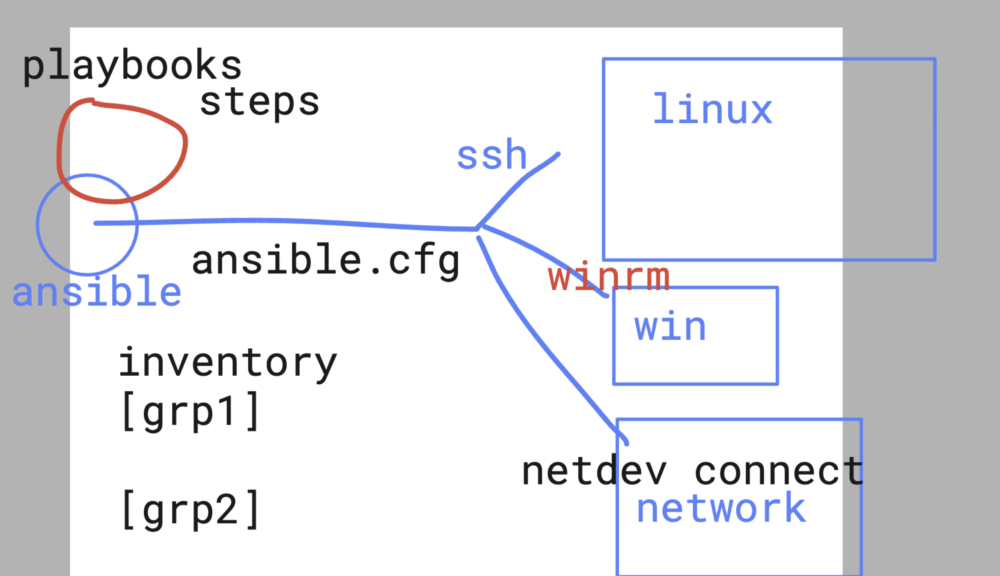
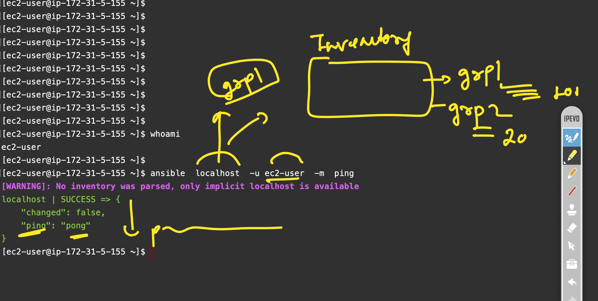
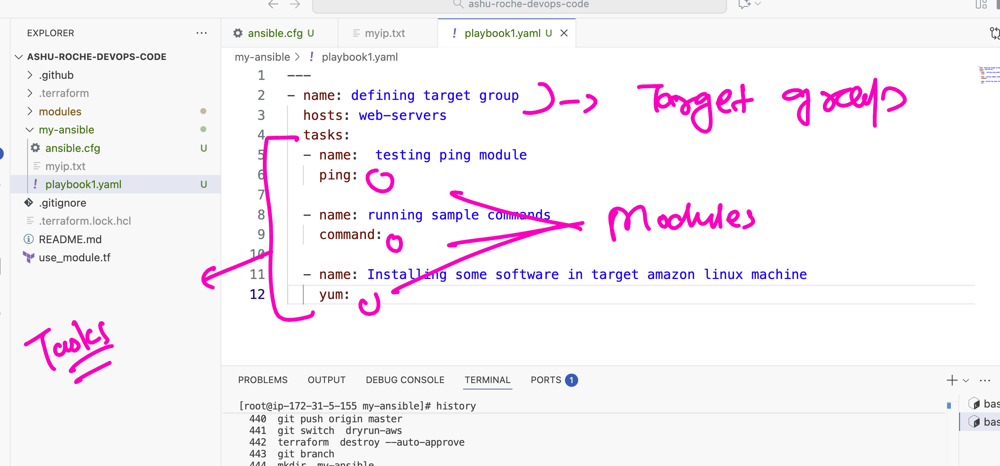

# roche_devops_4thnov2025

### ansible info 




### few ansible commands 

```
ec2-user@ip-172-31-5-155 ~]$ 
[ec2-user@ip-172-31-5-155 ~]$ ansible --version 
ansible [core 2.15.3]
  config file = None
  configured module search path = ['/home/ec2-user/.ansible/plugins/modules', '/usr/share/ansible/plugins/modules']
  ansible python module location = /usr/lib/python3.9/site-packages/ansible
  ansible collection location = /home/ec2-user/.ansible/collections:/usr/share/ansible/collections
  executable location = /usr/bin/ansible
  python version = 3.9.24 (main, Oct 16 2025, 00:00:00) [GCC 11.5.0 20240719 (Red Hat 11.5.0-5)] (/usr/bin/python3.9)
  jinja version = 3.1.4
  libyaml = True
[ec2-user@ip-172-31-5-155 ~]$ 
[ec2-user@ip-172-31-5-155 ~]$ 
[ec2-user@ip-172-31-5-155 ~]$ ls  /etc/ansible/
roles
[ec2-user@ip-172-31-5-155 ~]$ 
[ec2-user@ip-172-31-5-155 ~]$ 

```

### ansible adhoc commands 



### ansible adhoc command 

```
root@ip-172-31-5-155 my-ansible]# ansible  web-servers  -m ping   --ask-pass
SSH password: 
[WARNING]: Invalid characters were found in group names but not replaced, use -vvvv to see details
[WARNING]: Platform linux on host 172.31.5.155 is using the discovered Python interpreter at /usr/bin/python3.9, but future
installation of another Python interpreter could change the meaning of that path. See https://docs.ansible.com/ansible-
core/2.15/reference_appendices/interpreter_discovery.html for more information.
172.31.5.155 | SUCCESS => {
    "ansible_facts": {
        "discovered_interpreter_python": "/usr/bin/python3.9"
    },
    "changed": false,
    "ping": "pong"
}
[root@ip-172-31-5-155 my-ansible]# ansible  web-servers  -m ping   -k
SSH password: 
[WARNING]: Invalid characters were found in group names but not replaced, use -vvvv to see details
[WARNING]: Platform linux on host 172.31.5.155 is using the discovered Python interpreter at /usr/bin/python3.9, but future
installation of another Python interpreter could change the meaning of that path. See https://docs.ansible.com/ansible-
core/2.15/reference_appendices/interpreter_discovery.html for more information.
172.31.5.155 | SUCCESS => {
    "ansible_facts": {
        "discovered_interpreter_python": "/usr/bin/python3.9"
    },
    "changed": false,
    "ping": "pong"
}
```

### playbook 



### running playbook 

```
ansible-playbook    playbook1.yaml   -k
SSH password: 
[WARNING]: Invalid characters were found in group names but not replaced, use -vvvv to see details

PLAY [defining target group] ************************************************************************************************

TASK [Gathering Facts] ******************************************************************************************************
[WARNING]: Platform linux on host 127.0.0.1 is using the discovered Python interpreter at /usr/bin/python3.9, but future
installation of another Python interpreter could change the meaning of that path. See https://docs.ansible.com/ansible-
core/2.15/reference_appendices/interpreter_discovery.html for more information.
ok: [127.0.0.1]
[WARNING]: Platform linux on host 172.31.5.155 is using the discovered Python interpreter at /usr/bin/python3.9, but future
installation of another Python interpreter could change the meaning of that path. See https://docs.ansible.com/ansible-
core/2.15/reference_appendices/interpreter_discovery.html for more information.
ok: [172.31.5.155]

TASK [testing ping module] **************************************************************************************************
ok: [172.31.5.155]
ok: [127.0.0.1]

TASK [running sample commands] **********************************************************************************************
changed: [127.0.0.1]
changed: [172.31.5.155]

PLAY RECAP ******************************************************************************************************************
127.0.0.1                  : ok=3    changed=1    unreachable=0    failed=0    skipped=0    rescued=0    ignored=0   
172.31.5.155               : ok=3    changed=1    unreachable=0    failed=0    skipped=0    rescued=0    ignored=0   


```
